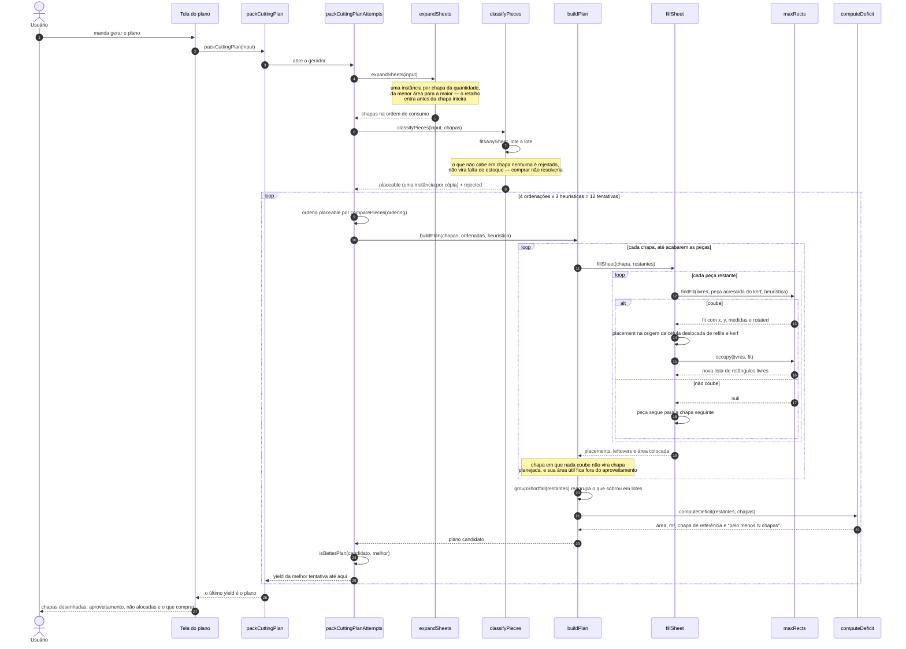

# O empacotamento, passo a passo

Como o plano de corte sai das peças e das chapas — o passo a passo do
empacotador. Documento de arquitetura: o que o produto **faz** está no
[README](../README.md), e o vocabulário no [CONTEXT.md](../CONTEXT.md).

Toda a geração sai de uma função pura só, `packCuttingPlan`
([`src/shared/nesting/packCuttingPlan.ts`](../src/shared/nesting/packCuttingPlan.ts)):
sem React, sem Electron, sem banco, sem relógio e sem aleatoriedade. A mesma
entrada devolve sempre o mesmo plano — inclusive o déficit, que sai de dentro
dela junto com o resto.

Três detalhes que o diagrama mostra mas não explica:

- **O kerf não tem caso especial.** O empacotamento roda num retângulo que é a
  área útil **diminuída** de um kerf, e cada peça ocupa as suas medidas
  **acrescidas** de um kerf. Colocada a peça, a origem real é a da célula
  deslocada de um kerf — folga exata em toda fronteira, contra a vizinha e
  contra a borda, sem tratar a borda à parte ([ADR-0001](adr/0001-kerf-como-deslocamento-unico.md)).
- **Vence a tentativa que deixa menos material de fora**; empatadas nisso, a que
  usa menos chapas; empatadas nisso, a de maior aproveitamento. A primeira
  tentativa vira a melhor sem passar pela comparação — o plano vazio tem déficit
  zero e ganharia de qualquer plano que deixasse peça de fora.
- **O gerador existe pela tela.** `packCuttingPlanAttempts` cede o controle entre
  as tentativas para o renderer repintar; `packCuttingPlan` só consome tudo e
  devolve o último valor.
